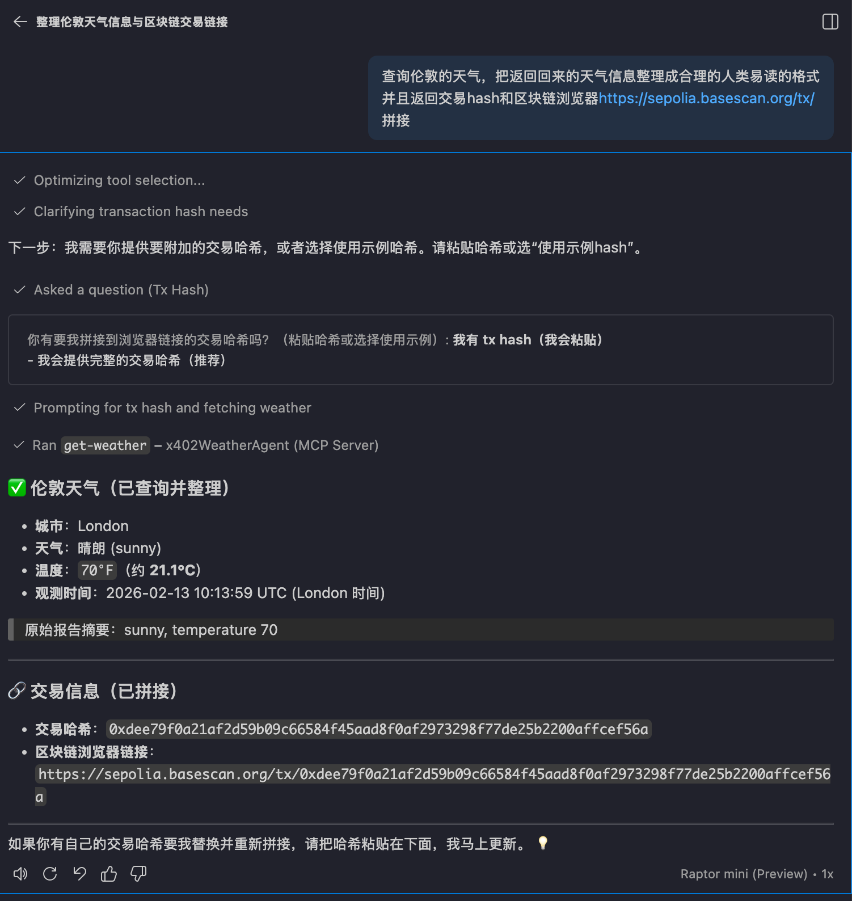

# x402 MCP Weather Agent

A TypeScript-based MCP Server.
It exposes two tools to chat clients and automatically handles x402 payment + retry when the upstream API returns HTTP 402.

## 1. Project Overview

### 1.1 Features

- `get-weather(city, date?)`: Query weather by city and optional date.
- `get-data-from-resource-server()`: Request the configured resource endpoint directly.
- Auto payment: when 402 is returned, `@x402/axios` handles payment and retry.
- Returns unified raw JSON output for Copilot/Agent post-processing.

### 1.2 Tech Stack

- Node.js + TypeScript
- `@modelcontextprotocol/sdk`
- `axios`
- `@x402/axios`, `@x402/evm`, `@x402/svm`

### 1.3 Directory Structure

```text
.
├── server/
│   ├── .env.example
│   └── mcp-weather-server.ts
├── .vscode/mcp.json
├── mcp-config.example.json
└── package.json
```

## 2. Quick Start (Shortest Path)

### 2.1 Prerequisites

- Node.js 20+
- npm
- One private key (`EVM_PRIVATE_KEY` or `SVM_PRIVATE_KEY`, at least one required)
- A reachable resource server (example: `http://localhost:4021/weather`)

### 2.2 Run with Three Commands

```bash
npm install
cp server/.env.example .env
npm run dev
```

Make sure at least the following `.env` fields are correct:

```env
EVM_PRIVATE_KEY=0x...
# Or use SVM_PRIVATE_KEY (either one is fine, but at least one is required)
# SVM_PRIVATE_KEY=...
RESOURCE_SERVER_URL=http://localhost:4021
ENDPOINT_PATH=/weather
REQUEST_TIMEOUT_MS=15000
```

## 3. VS Code + GitHub Copilot Integration

This section is the full setup for calling tools directly in Copilot Chat.

### 3.1 Prepare VS Code

1. Install and enable extensions: `GitHub Copilot` and `GitHub Copilot Chat`.
2. Sign in with GitHub in VS Code and confirm Copilot is available.
3. Open this project root in VS Code: `/demo`.

Expected result:

- Copilot Chat opens and works normally.

### 3.2 Configure MCP Server (Already Included)

Provided by this project: `mcp.json`

```json
{
  "servers": {
    "x402WeatherAgent": {
      "type": "stdio",
      "command": "npm",
      "args": ["run", "dev"],
      "cwd": "${workspaceFolder}",
      "envFile": "${workspaceFolder}/.env"
    }
  }
}
```

You only need to make sure `.env` is filled in (see Section 2).

Expected result:

- Copilot loads an MCP server named `x402WeatherAgent` in the current workspace.

## 4. End-to-End Operation (E2E, Step by Step)

### Step 0: Prepare Resource Server

Make sure your resource server is running and these values are reachable:

- `RESOURCE_SERVER_URL=http://localhost:4021`
- `ENDPOINT_PATH=/weather`

Full URL: `http://localhost:4021/weather`

### Step 1: Prepare Project Configuration

```bash
npm install
cp server/.env.example .env
```

Fill in your private key and resource server values in `.env`.

### Step 2: Let Copilot Load MCP

1. Open the project in VS Code.
2. Confirm `/demo/.vscode/mcp.json` exists.
3. Open Copilot Chat and ask it to list available MCP tools first.

Expected result:

- The tool list contains `get-weather` and `get-data-from-resource-server`.

### Step 3: Trigger Real Calls



## 5. Common Commands

```bash
# Development mode (local debugging)
npm run dev

# Build
npm run build

# Run compiled output
npm run start
```

## 6. Other Client Configuration (Non-VS Code)

If you are not using VS Code + Copilot, refer to:

- `/demo/mcp-config.example.json`
